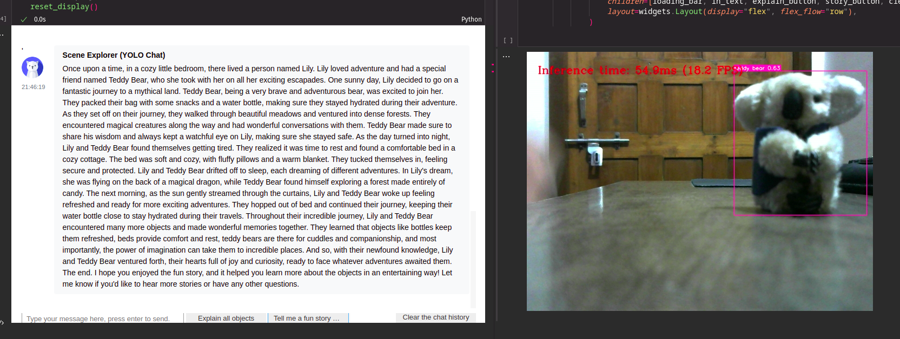

# Scene Explorer for kids (OpenVINO optimised YOLOv8 + OpenAI Chat API with functions)
This is a fun application of OpenVINO and OpenAI Chatbot API. (Mostly a copy of the [Indoor Care Chatbot](https://github.com/AJV009/indoor-care-chatbot) that i developed previously. This is just an experimental project to see if we can use the same chatbot to interact with the environment and answer questions about the environment.)


## Some interesting capabilities of the chatbot:
- When asked about objects in the sorrounding, it can detect and answer questions about the objects.
- Currently, it can detect 80 different objects. (According to the COCO dataset)
- Uses a YOLOv8 model that is optimised using OpenVINO to run on CPU.
- Uses the functions capablities of OpenAI Chat API to trigger actions like finding nearby objects.
- There are a couple of pre made buttons inside the Chat UI that can be triggered to get a fun learning story about all the objects in the scene or just understand about the scene in general.

## How it works?
- The chatbot is initialised with a YOLOv8 model that is optimised using OpenVINO to run on CPU.
- The following is the system prompt that drives the GPT behaviour:
    ```
    You are a fun assistant for 5yr old kids.
    You have to help them understand and learn about daily objects.
    You are connected to a YOLO Camera.
    You are obviously placed in a room.
    ```
- When the users asks something like "What is it that I am seeing?", the chatbot will do the following:
    - First collect all the frame data from a specified amount of time. (Refer `text_eventhandler` in `main.ipynb`.)
    - Then pass the extracted data is passed to the helper function, in our case it will be `identify_object` in `main.ipynb` which will quickly check if the `all_detected_objects` is empty or not. Whatever the case maybe be it will return a string of all the objects in the scene.
    - This string is then passed to the chat api to generate a meaningful response.

## How can this be used?
- This can be implemented as a plugin for portable kids assistants or mobile apps.
- Children can ask questions like "what is this?" or "tell me a story about this!" or "what can I do with this teddy bear?" and the chatbot will answer accordingly.

## How can this project be extended? (Since this is just an experimental project, we can extend it in the following ways)
- It runs of a notebook, this can be easily adapted to run on a smaller IoT device like a Raspberry Pi with connected camera and a microphone for user interactions.
- Should be trained with a larger indoor objects dataset to be more accurate.
- We can add more useful functions like "detect harmful objects in the vicinity of the kid and alert the elders and kids", "find my specific toy" and so on. (When it comes to child entertainment and safety, the possibilities are endless.)

## How to run
1. Install the requirements:
    ```bash
    pip install -r requirements.txt
    ```
2. Create the optimized model by running the notebook cells at `prepareModel.ipynb` to convert the model to OpenVINO format. **(IMPORTANT)**
2. Run the cells at `main.ipynb` to start the chatbot and interact with it.
    
_Note: Demo won't work without creating the optimized model._

## Project file structure
- `utils/` - Contains all the helper functions.
    - `objectDetect.py` - Contains all the functions related to object detection.
        - `run_object_detection` - Runs the object detection model on the input frame.
    - `postProcess.py` - Contains all the functions related to post processing of the object detection results.
        - `draw_results` - Draws the bounding boxes and calculates the distances between all objects in all the frames of the specified amount of time.
    - `videoPlayer.py` - Contains all the functions related to video playback.
    - `downloader.py` - Contains all the functions related to downloading files.
- `prepareModel.ipynb` - Converts the model to OpenVINO format.
- `main.ipynb` - Starts the chatbot and interacts with it. (As shown in the demo images below.)


## Demo (CPU)
_Live interaction with the scene using the chatbot. (Left - Chatbot, Right - Camera feed. Notebook split to show the camera feed which outputs the live frames a cell above the chatbot cell.)_



_OpenVINO Optimized YOLOv8 Model running on a CPU_

